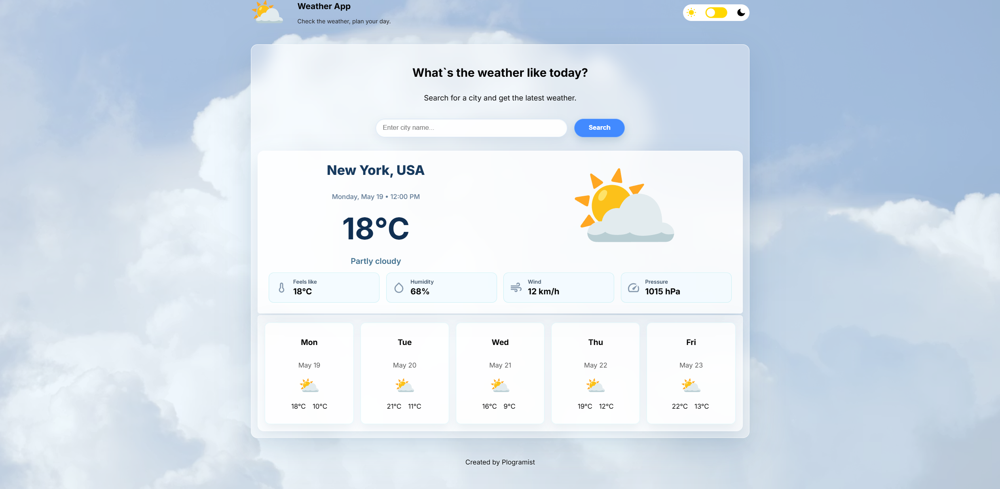
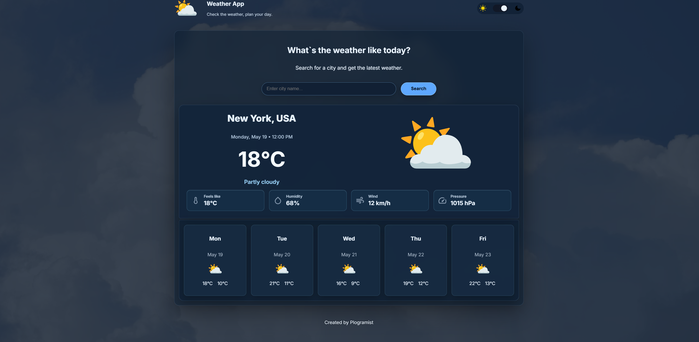

# Weather App

A simple weather application that allows users to search for a city and view current weather information.

The main goal was to improve my skills in JavaScript, working with APIs, DOM manipulation, user input handling, and creating a clean responsive interface.

## Live Demo

-- In development --

## Screenshots 

(Light theme, dark theme)





## Features

- Search weather by city name
- Display current temperature
- Show weather condition
- Show humidity
- Show wind speed
- Get dynamic weather data from an API
- Responsive design for different screen sizes
- Clean and simple user interface

## Technologies Used

- HTML
- CSS
- JavaScript
- Weather API
- Git
- GitHub

## What I Practiced

- Working with an external API
- Using `fetch()` to get data
- Handling user input
- Working with weather data
- Basic error handling
- Creating a responsive layout
- Organizing project files
- Using Git and GitHub for version control

## How to Run Locally

1. Clone the repository:

```bash
git clone https://github.com/Plogramist/Weather-App.git
```

2. Open the project folder:

```bash
cd Weather-App
```

3. Open `index.html` in your browser.

## Project Status

The basic version of the project is in development.

In the future, I may improve it by adding:

- Better error messages
- Loading state
- Dark / light theme
- 5-day forecast
- Saving recent searches
- Better UI animations

## Author

Created by **Plogramist**  

GitHub: [@Plogramist](https://github.com/Plogramist)
